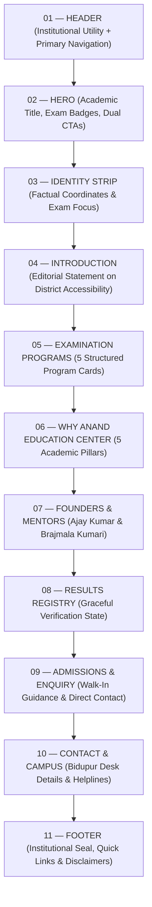

# Anand Education Center — Homepage Wireframe & Content Hierarchy
**Document Version:** 1.0.0  
**Status:** Approved Architectural Wireframe Specification  
**Source of Truth References:**  
- [`docs/BRAND_SYSTEM.md`](file:///c:/Users/User/OneDrive/Desktop/AEC/docs/BRAND_SYSTEM.md)  
- [`docs/INFORMATION_ARCHITECTURE.md`](file:///c:/Users/User/OneDrive/Desktop/AEC/docs/INFORMATION_ARCHITECTURE.md)  
**Scope:** Homepage Structural Layout, Wireframe Blueprints, Visual Rhythm & Copy Guidelines

---

## 1. Homepage Purpose

The Anand Education Center homepage is the digital front door of a real competitive-examination institute rooted in **Bidupur, Vaishali, Bihar, India**. 

### 1.1 Core Mission
Within the first 3 to 5 seconds of arriving on the homepage, any visitor (aspirant, parent, or local resident) must immediately understand:
- **WHAT:** Anand Education Center — a serious, disciplined coaching and mentoring institution.
- **WHO FOR:** Aspirants preparing for India’s premier administrative and government competitive examinations.
- **EXAMINATIONS:** Focused solely on **UPSC, BPSC, SSC, Railway, and Banking**.
- **WHERE:** Physically situated in **Bidupur, Vaishali, Bihar**.
- **PRIMARY ACTION:** Clear, non-pressuring pathway to enquire, speak with the institute desk, or visit the center.

### 1.2 Tone & Visual Atmosphere
- **Academic Seriousness:** Quiet, authoritative rigor inspired by civil services academies and editorial educational institutions.
- **Grounded Trust & Warmth:** A respected family institution founded by **Ajay Kumar** and **Brajmala Kumari**, avoiding corporate impersonality.
- **Zero Commercial Coaching Clutter:** Absolute absence of countdown timers, neon popups, spinning coin counters, flashing "Discount" badges, or unverified claims.

---

## 2. Above-the-Fold Hierarchy

The initial viewport (desktop and mobile) commands immediate respect through strong typography, authentic institutional branding, and unambiguous orientation.

```
┌────────────────────────────────────────────────────────────────────────────────────────┐
│ TOP UTILITY STRIP:  Bidupur, Vaishali, Bihar  |  Helpline: 7766959980 / 9905871193     │
├────────────────────────────────────────────────────────────────────────────────────────┤
│ MASTER HEADER:                                                                         │
│ [AEC LOGO]           Home   About   Courses   Faculty   Results   Admissions   Contact     │
│                                                  [ENQUIRE NOW]  [Student Login]        │
├────────────────────────────────────────────────────────────────────────────────────────┤
│ HERO REGION:                                                                           │
│                                                                                        │
│   EYEBROW:       ANAND EDUCATION CENTER • BIDUPUR, VAISHALI                            │
│                                                                                        │
│   HEADLINE:      Rigorous Mentorship for India's Most Demanding                        │
│                  Competitive Examinations.                                             │
│                                                                                        │
│   LEAD COPY:     Guiding aspirants through disciplined preparation for civil services  │
│                  and national recruitment commissions. Grounded in academic rigor.     │
│                                                                                        │
│   EXAM TRACKS:   [UPSC]  [BPSC]  [SSC]  [RAILWAY]  [BANKING]                           │
│                                                                                        │
│   ACTIONS:       [ ENQUIRE NOW ]    [ Explore Courses -> ]                             │
│                                                                                        │
└────────────────────────────────────────────────────────────────────────────────────────┘
```

---

## 3. Complete Section Order & Visual Rhythm

To avoid the fatigue of repetitive "card grids", the homepage alternates between editorial text layouts, structured metadata strips, distinct cards, and personal human portraits.



### 3.1 Visual Rhythm Pattern
1. **Header (Structural Utility):** High-contrast navigation and direct phone access.
2. **Hero (Editorial Statement):** Generous whitespace, large serif typography, focused exam tags.
3. **Identity Strip (Monochrome Ribbon):** Thin, elegant horizontal band reinforcing factual markers.
4. **Introduction (Editorial Asymmetry):** Text-forward column layout detailing the educational mission in Vaishali.
5. **Examination Programs (Disciplined Grid):** 5 balanced cards with sharp 4px corners and subtle borders.
6. **Academic Pillars (Split Horizontal List):** Left-side sticky headline with right-side sequential list.
7. **Founders (Warm Human Portraits):** Two side-by-side dignified portrait modules for Ajay Kumar and Brajmala Kumari.
8. **Results (Calm Verification Panel):** Single-column transparent placeholder box confirming strict administrative review.
9. **Admissions & Enquiry (Conversion Banner):** Contrast Deep Navy panel featuring primary phone lines and walk-in guidance.
10. **Contact & Campus (Two-Column Desk Map/Directory):** Physical address, campus telephone lines, and enquiry hours.
11. **Footer (Formal Academic Base):** Complete institutional metadata, sitemap links, and non-commercial disclaimers.

---

## 4. Header Structural Wireframe

### 4.1 Desktop Wireframe (Width: 1200px max, Height: 84px total)

```
┌────────────────────────────────────────────────────────────────────────────────────────┐
│ [UTILITY BAR - 32px height | Warm Navy or Subtle Slate Background]                     │
│  📍 Bidupur, Vaishali, Bihar, India           📞 Helplines: +91 7766959980, 9905871193 │
├────────────────────────────────────────────────────────────────────────────────────────┤
│ [MAIN HEADER - 56px height | Warm White Canvas #FAFAF7 | 1px border-bottom #EBECE9]    │
│                                                                                        │
│  [AEC LOGO]        Home   About   Courses   Faculty   Results   Admissions   Contact   │
│  (Height: 40px)                                                                        │
│                                                   [ ENQUIRE NOW ]   [Student Login ->] │
│                                                   (Navy Button)     (Muted Slate Link) │
└────────────────────────────────────────────────────────────────────────────────────────┘
```

### 4.2 Mobile Wireframe (Width: 320px–414px, Height: 60px)

```
┌──────────────────────────────────────────────────────────────────┐
│  [AEC LOGO - 32px height]                   [ 📞 ]   [ ☰ MENU ]  │
└──────────────────────────────────────────────────────────────────┘
```

#### Mobile Slide-Over Drawer:
- Header: Logo + Close [×] button
- Quick Action: `[ 📞 Call Institute: 7766959980 ]`
- Navigation List:
  - `01 Home`
  - `02 About Institute`
  - `03 Examination Courses (UPSC, BPSC, SSC, Railway, Banking)`
  - `04 Faculty & Founders`
  - `05 Results Registry`
  - `06 Admissions Desk`
  - `07 Contact Campus`
- Divider line
- Secondary Action: `[ Student Portal Login -> ]`
- Center Address: `Bidupur, Vaishali, Bihar`

---

## 5. Hero Structural Wireframe & Photography Analysis

### 5.1 Hero Blueprint (Desktop)

```
┌────────────────────────────────────────────────────────────────────────────────────────┐
│ HERO CONTAINER (Padding: 80px top / 64px bottom | Background: #FAFAF7)                 │
│                                                                                        │
│  [ Eyebrow Badge ]  ACADEMIC EXCELLENCE • BIDUPUR, VAISHALI DISTRICT                  │
│                                                                                        │
│  [ Serif Heading ]  Disciplined Preparation for                                       │
│                     India's Competitive Examinations                                  │
│                                                                                        │
│  [ Body Lead ]      Anand Education Center provides structured curriculum guidance,    │
│                     concept rigor, and consistent testing for civil services and      │
│                     national commission examinations.                                  │
│                                                                                        │
│  [ Exam Chips ]     ┌────────┐  ┌────────┐  ┌───────┐  ┌───────────┐  ┌─────────┐      │
│                     │  UPSC  │  │  BPSC  │  │  SSC  │  │  RAILWAY  │  │ BANKING │      │
│                     └────────┘  └────────┘  └───────┘  └───────────┘  └─────────┘      │
│                                                                                        │
│  [ Action Buttons ] ┌───────────────────┐    ┌───────────────────────────┐             │
│                     │   ENQUIRE NOW     │    │  Explore Courses (5)  ->  │             │
│                     └───────────────────┘    └───────────────────────────┘             │
│                     (Primary Navy Button)    (Secondary Outline Button)                │
│                                                                                        │
│  [ Subtext Notice ] Official Campus: Bidupur, Vaishali | Helplines: 7766959980 / ...   │
└────────────────────────────────────────────────────────────────────────────────────────┘
```

---

### 5.2 Hero Photography Decision: Comparison & Architectural Recommendation

We have conducted a thorough architectural trade-off analysis between two structural treatments for the hero region:

| Architectural Criteria | OPTION A: Typography-Led Hero with Logo & Academic Seals | OPTION B: Hero with Integrated Founder Portrait Area |
| :--- | :--- | :--- |
| **Institutional Authority** | **Superior:** Mirrors Oxford, IAS Academy, or national university portals. Focuses entirely on academic gravitas and exam categories. | Moderate: Shifts emphasis toward personal coaching rather than institutional permanence. |
| **Trust & Clarity** | **High:** Immediate comprehension of the five exam tracks without visual competition. | High: Adds immediate personal warmth, but risks visual clutter on compact screens. |
| **Authenticity** | **High:** Uses the verified brand mark and factual curriculum tags without decorative filler. | **High:** Real family founders are showcased immediately. |
| **Mobile Responsiveness** | **Flawless:** Pure typography and badges reflow gracefully from 320px to 1440px with zero cropping anomalies. | **Challenging:** Requires vertical stacking; founder photos push exam categories and primary CTAs far below the fold on mobile. |
| **Long-Term Scalability** | **Exceptional:** As faculty members or course tracks expand, the hero layout remains stable and pristine. | Moderate: If the team grows or multiple mentors join, the hero requires structural redesign. |

#### Architectural Recommendation: **OPTION A (Typography-Led Hero)**
- **Decision:** Adopt **Option A** for the Hero section, and reserve **Section 07 (Founders & Academic Mentorship)** as a dedicated, prominent showcase for Ajay Kumar and Brajmala Kumari.
- **Rationale:** 
  1. This guarantees that on mobile viewports (320px–414px), the student immediately sees the **institute identity, the 5 examination tracks, and the direct Enquiry/Call CTAs** without scrolling past large portrait images.
  2. Placing the founders in their own dedicated editorial section gives them greater dignity and room for personal biographical context, rather than cramming their photographs into a crowded hero split-screen.

---

## 6. Section 03 — Identity & Trust Strip

*Purpose: Reinforce factual coordinates and exam scope without fabricated numerical metrics.*

```
┌────────────────────────────────────────────────────────────────────────────────────────┐
│ [IDENTITY STRIP: 1px border-top & bottom #EBECE9 | Background: #FFFFFF | Padding: 20px]│
│                                                                                        │
│   INSTITUTE            LOCATION               CURRICULUM FOCUS          HELPLINES      │
│   Anand Education      Bidupur, Vaishali      UPSC • BPSC • SSC         7766959980     │
│   Center               Bihar, India           Railway • Banking         9905871193     │
└────────────────────────────────────────────────────────────────────────────────────────┘
```

---

## 7. Section 04 — Introduction (Editorial Asymmetry)

*Purpose: Establish geographic context and educational mission in Vaishali district without fabricated history.*

```
┌────────────────────────────────────────────────────────────────────────────────────────┐
│ [SECTION PADDING: 72px top / 72px bottom | Background: #FAFAF7]                        │
│                                                                                        │
│  COLUMN 1 (Left 35%):                                                                  │
│  [ Eyebrow ]   ABOUT ANAND EDUCATION CENTER                                            │
│  [ Serif H2 ]  Grounded in Vaishali.                                                   │
│                Committed to Student                                                    │
│                Success.                                                                │
│                                                                                        │
│  COLUMN 2 (Right 65%):                                                                 │
│  [ Lead Paragraph ]                                                                    │
│  Founded in Bidupur, Vaishali, Anand Education Center was established to provide       │
│  district-level aspirants with rigorous, disciplined preparation for national and      │
│  state-level competitive examinations.                                                 │
│                                                                                        │
│  [ Body Paragraph ]                                                                    │
│  We focus on systematic syllabus coverage, conceptual fundamentals, and consistent    │
│  testing—enabling students to prepare with focus and clarity.                          │
│                                                                                        │
│  [ Link Button ]                                                                       │
│  [ Learn More About the Institute -> ] (Navigates to /about)                           │
└────────────────────────────────────────────────────────────────────────────────────────┘
```

---

## 8. Section 05 — Examination Programs

*Purpose: Five clean, disciplined cards linking to individual examination tracks. Zero fabricated fees or durations.*

```
┌────────────────────────────────────────────────────────────────────────────────────────┐
│ [SECTION HEADER: Centered or Left-aligned with Eyebrow]                                │
│  EYEBROW:  PREPARATION TRACKS                                                          │
│  HEADING:  Competitive Examination Programs                                            │
│  SUBTEXT:  Structured coaching aligned with the latest commission notification syllabi.│
├────────────────────────────────────────────────────────────────────────────────────────┤
│ [GRID: 3 columns top row, 2 columns bottom row centered (Desktop) / 1 column (Mobile)] │
│                                                                                        │
│  ┌───────────────────────┐ ┌───────────────────────┐ ┌───────────────────────┐         │
│  │ 01 • UPSC             │ │ 02 • BPSC             │ │ 03 • SSC              │         │
│  │ Civil Services        │ │ Combined Competitive  │ │ Staff Selection       │         │
│  │ Examination           │ │ Examination           │ │ Commission            │         │
│  │ ────────────────────  │ │ ────────────────────  │ │ ────────────────────  │         │
│  │ Prelims, Mains, and   │ │ Comprehensive Bihar   │ │ CGL, CHSL, CPO, and   │         │
│  │ General Studies       │ │ State Administrative  │ │ GD examination tracks │         │
│  │ foundation.           │ │ Services prep.        │ │ with practice drills. │         │
│  │                       │ │                       │ │                       │         │
│  │ [ View Track -> ]     │ │ [ View Track -> ]     │ │ [ View Track -> ]     │         │
│  └───────────────────────┘ └───────────────────────┘ └───────────────────────┘         │
│                                                                                        │
│              ┌───────────────────────┐ ┌───────────────────────┐                       │
│              │ 04 • RAILWAY          │ │ 05 • BANKING          │                       │
│              │ Railway Recruitment   │ │ Banking & Financial   │                       │
│              │ Board (RRB)           │ │ Services              │                       │
│              │ ────────────────────  │ │ ────────────────────  │                       │
│              │ NTPC, Group D, ALP,   │ │ IBPS PO/Clerk, SBI    │                       │
│              │ and Technical grade   │ │ PO/Clerk, and RBI     │                       │
│              │ preparation.          │ │ recruitment guidance. │                       │
│              │                       │ │                       │                       │
│              │ [ View Track -> ]     │ │ [ View Track -> ]     │                       │
│              └───────────────────────┘ └───────────────────────┘                       │
└────────────────────────────────────────────────────────────────────────────────────────┘
```

---

## 9. Section 06 — Why Anand Education Center (5 Academic Pillars)

*Purpose: Present institutional methodology purely as structural categories, avoiding fabricated claims.*

```
┌────────────────────────────────────────────────────────────────────────────────────────┐
│ [LAYOUT: Left Column Headline + Right Column Sequential List]                          │
│                                                                                        │
│  LEFT COLUMN (40%):                                                                    │
│  [ Eyebrow ]   INSTITUTIONAL METHODOLOGY                                               │
│  [ Serif H2 ]  Our Core Preparation                                                    │
│                Pillars                                                                 │
│  [ Body ]      A structured academic environment built on consistent practice,         │
│                syllabus mastery, and regular guidance.                                 │
│                                                                                        │
│  RIGHT COLUMN (60%):                                                                   │
│  ┌──────────────────────────────────────────────────────────────────────────────────┐  │
│  │ 01 • Faculty Guidance                                                            │  │
│  │ Direct classroom teaching and personal doubt-resolution from dedicated mentors.  │  │
│  ├──────────────────────────────────────────────────────────────────────────────────┤  │
│  │ 02 • Structured Preparation                                                      │  │
│  │ Step-by-step syllabus pacing designed to cover fundamentals before mock testing. │  │
│  ├──────────────────────────────────────────────────────────────────────────────────┤  │
│  │ 03 • Practice & Testing                                                          │  │
│  │ Regular chapter evaluations and simulated full-length examination test series.   │  │
│  ├──────────────────────────────────────────────────────────────────────────────────┤  │
│  │ 04 • Curated Study Material                                                      │  │
│  │ Focused study notes, question banks, and relevant exam-oriented reading sets.    │  │
│  ├──────────────────────────────────────────────────────────────────────────────────┤  │
│  │ 05 • Personal Attention                                                          │  │
│  │ Manageable batch sizes ensuring individual progress monitoring and feedback.     │  │
│  └──────────────────────────────────────────────────────────────────────────────────┘  │
└────────────────────────────────────────────────────────────────────────────────────────┘
```

---

## 10. Section 07 — Founders & Academic Mentorship

*Purpose: Emotional core of the institution. Dignified, authentic presentation of the founders using real photographs. Zero fabricated degrees or titles.*

```
┌────────────────────────────────────────────────────────────────────────────────────────┐
│ [SECTION HEADER: Centered]                                                             │
│  EYEBROW:  LEADERSHIP & MENTORSHIP                                                     │
│  HEADING:  Founded on Family Dedication & Academic Guidance                            │
│  SUBTEXT:  Rooted in Bidupur, providing personal commitment to every student.          │
├────────────────────────────────────────────────────────────────────────────────────────┤
│ [TWO-COLUMN PORTRAIT CARDS]                                                            │
│                                                                                        │
│  ┌─────────────────────────────────────┐  ┌─────────────────────────────────────┐      │
│  │ [ REAL PHOTOGRAPH: Ajay Kumar ]     │  │ [ REAL PHOTOGRAPH: Brajmala Kumari] │      │
│  │ (Aspect Ratio: 4:5, Natural crop)   │  │ (Aspect Ratio: 4:5, Natural crop)   │      │
│  │                                     │  │                                     │      │
│  │ AJAY KUMAR                          │  │ BRAJMALA KUMARI                     │      │
│  │ Founder                             │  │ Co-Founder                          │      │
│  │ ─────────────────────────────────── │  │ ─────────────────────────────────── │      │
│  │ Committed to guiding students with  │  │ Dedicated to student welfare,       │      │
│  │ discipline, exam strategy, and      │  │ academic discipline, and center     │      │
│  │ continuous academic support.        │  │ administration.                     │      │
│  │                                     │  │                                     │      │
│  │ [ View Full Profile -> ]            │  │ [ View Full Profile -> ]            │      │
│  └─────────────────────────────────────┘  └─────────────────────────────────────┘      │
└────────────────────────────────────────────────────────────────────────────────────────┘
```

---

## 11. Section 08 — Results Registry (Graceful Empty State)

*Purpose: Transparent, honest handling of the results section. Zero fabricated ranks or student counts.*

```
┌────────────────────────────────────────────────────────────────────────────────────────┐
│ [SECTION CONTAINER: Light Gray/Navy Wash Background #F8F9FA | 1px border #EBECE9]      │
│                                                                                        │
│  [ Eyebrow ]   DOCUMENTED ACHIEVEMENTS                                                 │
│  [ Serif H2 ]  Verified Results & Selections                                           │
│                                                                                        │
│  ┌──────────────────────────────────────────────────────────────────────────────────┐  │
│  │ [ ICON / CREST MARK: Neutral Shield ]                                            │  │
│  │                                                                                  │  │
│  │ Official Verification Registry in Progress                                       │  │
│  │                                                                                  │  │
│  │ Anand Education Center maintains a strict policy of publishing only officially   │  │
│  │ verified selections, scorecards, and roll numbers. Candidate milestones will be  │  │
│  │ published here following administrative verification.                            │  │
│  │                                                                                  │  │
│  │ [ Inquire About Current Batches -> ]                                             │  │
│  └──────────────────────────────────────────────────────────────────────────────────┘  │
└────────────────────────────────────────────────────────────────────────────────────────┘
```

---

## 12. Section 09 — Admissions & Direct Enquiry

*Purpose: High-clarity conversion section with direct phone lines and clean inquiry form.*

```
┌────────────────────────────────────────────────────────────────────────────────────────┐
│ [FULL-WIDTH CONTAINER: Deep Navy Background #0B1F3A | Text: Inverse #FFFFFF]           │
│                                                                                        │
│  COLUMN 1 (Left 50% - Advisory & Direct Call):                                         │
│  [ Eyebrow: Gold Accent ]  ADMISSIONS & COUNSELING                                     │
│  [ Serif H2 ]              Ready to Begin Your Preparation?                            │
│  [ Body ]                  Visit our Bidupur center for in-person academic guidance,   │
│                            syllabus reviews, and current batch availability.           │
│                                                                                        │
│  [ Direct Helpline Box: Border 1px #163259 | Background: #071527 ]                    │
│  📞 Helpline 1: +91 7766959980                                                         │
│  📞 Helpline 2: +91 9905871193                                                         │
│  📍 Walk-In Desk: Bidupur, Vaishali, Bihar                                             │
│                                                                                        │
│  COLUMN 2 (Right 50% - Clean Enquiry Form Card | Background: #FFFFFF | Text: #172033): │
│  ┌──────────────────────────────────────────────────────────────────────────────────┐  │
│  │ QUICK ADMISSION ENQUIRY                                                          │  │
│  │                                                                                  │  │
│  │ Full Name:          [ e.g. Rahul Kumar                             ]             │  │
│  │ Contact Number:     [ +91 10-digit mobile number                   ]             │  │
│  │ Target Examination: [ Select: UPSC | BPSC | SSC | Railway | Bank ▾ ]             │  │
│  │ Message / Query:    [ Questions about batches or timings...        ]             │  │
│  │                                                                                  │  │
│  │ [ SUBMIT ENQUIRY ] (Navy Full-width Button)                                      │  │
│  │ <small>Your information is used solely to respond to your academic inquiry.</small>│
│  └──────────────────────────────────────────────────────────────────────────────────┘  │
└────────────────────────────────────────────────────────────────────────────────────────┘
```

---

## 13. Section 10 — Contact & Campus Desk

*Purpose: Comprehensive physical location details and direct contact coordinates.*

```
┌────────────────────────────────────────────────────────────────────────────────────────┐
│ [SECTION PADDING: 64px top / 64px bottom | Background: #FAFAF7]                        │
│                                                                                        │
│  COLUMN 1 (Address & Information):                                                     │
│  [ Eyebrow ]   CAMPUS LOCATION                                                         │
│  [ Serif H2 ]  Visit Anand Education Center                                            │
│                                                                                        │
│  📍 Physical Address:                                                                  │
│     Anand Education Center                                                             │
│     Bidupur, Vaishali, Bihar, India                                                    │
│                                                                                        │
│  📞 Direct Contact Numbers:                                                            │
│     +91 7766959980                                                                     │
│     +91 9905871193                                                                     │
│                                                                                        │
│  COLUMN 2 (Location Map / Directions Placeholder):                                     │
│  ┌──────────────────────────────────────────────────────────────────────────────────┐  │
│  │ [ MAP PLACEHOLDER BOX: Aspect Ratio 16:9 | 1px border #D0D5DD ]                  │  │
│  │ Interactive Google Maps integration pointing directly to Bidupur, Vaishali.      │  │
│  │ Direct transit guidance for local aspirants across Vaishali district.            │  │
│  └──────────────────────────────────────────────────────────────────────────────────┘  │
└────────────────────────────────────────────────────────────────────────────────────────┘
```

---

## 14. Section 11 — Institutional Footer

*Purpose: Master branding, sitemap navigation, examination directory, and transparent disclaimer.*

```
┌────────────────────────────────────────────────────────────────────────────────────────┐
│ [FOOTER CONTAINER: Deep Navy Dark #071527 | Text: #CBD5E1 | 1px border-top #163259]     │
│                                                                                        │
│  COL 1 (Brand Profile):    COL 2 (Programs):    COL 3 (Quick Links):  COL 4 (Campus):  │
│  [AEC MASTER LOGO]         • UPSC               • Home                Bidupur,         │
│  Anand Education Center    • BPSC               • About Institute     Vaishali,        │
│  Competitive Examination   • SSC                • Faculty Mentors     Bihar, India     │
│  Preparation Institute.    • Railway            • Results Registry    📞 7766959980    │
│  Bidupur, Vaishali, Bihar  • Banking            • Admissions Desk     📞 9905871193    │
│                                                 • Contact Us                           │
│                                                 • [Student Login]                      │
├────────────────────────────────────────────────────────────────────────────────────────┤
│ [LEGAL & DISCLAIMER STRIP: Padding: 20px top / bottom | Font-size: 13px]               │
│ © 2026 Anand Education Center. All rights reserved.                                    │
│ Disclaimer: Anand Education Center is a private competitive examination preparatory    │
│ institute. Examination names (UPSC, BPSC, SSC, RRB, IBPS, SBI) are trademarks of their │
│ respective public commissions and are referenced solely for curriculum alignment.      │
└────────────────────────────────────────────────────────────────────────────────────────┘
```

---

## 15. Desktop Layout Specifications (1024px – 1440px+)

| Layout Attribute | 1024px Viewport | 1280px Viewport | 1440px+ Viewport |
| :--- | :--- | :--- | :--- |
| **Max Content Container** | `960px` centered | `1160px` centered | `1200px` centered |
| **Global Side Gutters** | `32px` | `48px` | `Auto-centered` (min 64px) |
| **Hero Vertical Padding** | `64px top / 56px bottom` | `80px top / 64px bottom` | `96px top / 80px bottom` |
| **Hero Title Size** | `2.25rem` (36px) | `2.5rem` (40px) | `2.75rem` (44px) |
| **Exam Programs Grid** | 3 columns (row 1) + 2 columns (row 2) | 3 cols + 2 cols centered | 3 cols + 2 cols centered |
| **Founders Section** | 2 balanced columns (50% / 50%) | 2 balanced columns | 2 balanced columns |
| **Admissions Layout** | 2 columns (50% / 50%) | 2 columns (50% / 50%) | 2 columns (50% / 50%) |
| **Footer Structure** | 4-column balanced grid | 4-column balanced grid | 4-column balanced grid |

---

## 16. Mobile Layout Specifications (320px – 414px)

| Component | 320px (Compact Mobile) | 360px – 390px (Standard) | 414px (Large Mobile) |
| :--- | :--- | :--- | :--- |
| **Horizontal Padding** | Strict `16px` | `16px` | `20px` |
| **Header Height & Logo** | `56px` total, Logo height `32px` | `60px` total, Logo `34px` | `60px` total, Logo `36px` |
| **Hero Headline** | `1.75rem` (28px), line-height 1.2 | `1.875rem` (30px) | `2.0rem` (32px) |
| **Hero CTA Buttons** | Full-width vertical stack | Full-width vertical stack | Side-by-side or stacked |
| **Exam Indicators** | Wrap flex-row (2 per line) | Wrap flex-row (2–3 per line) | Single horizontal row |
| **Program Cards** | 1 column (100% width) | 1 column (100% width) | 1 column (100% width) |
| **Founders Section** | 1 column (Ajay Kumar then Brajmala Kumari) | 1 column | 1 column |
| **Enquiry Form Inputs** | Height `44px`, 100% width | Height `44px`, 100% width | Height `44px`, 100% width |
| **Direct Call Action** | Prominent click-to-call button | Prominent click-to-call button | Prominent click-to-call button |
| **Horizontal Overflow** | Zero tolerance (`overflow-x: hidden`) | Zero tolerance | Zero tolerance |

---

## 17. Call-to-Action (CTA) Hierarchy

Every button and link on the homepage adheres to an unambiguous 3-tier hierarchy:

1. **Primary Action (Institutional Commitment):**
   - Label: `ENQUIRE NOW`
   - Visual Treatment: Deep Navy background (`#0B1F3A`), white text, 4px radius.
   - Triggers: Admissions enquiry modal, scroll to Section 09, or direct call on mobile.
2. **Secondary Action (Academic Exploration):**
   - Label: `EXPLORE COURSES` / `VIEW PROGRAM DETAILS`
   - Visual Treatment: 1px border (`#D0D5DD`), transparent background, navy text.
   - Triggers: Navigation to `/courses` or specific exam tracks.
3. **Tertiary Direct Action (Local Reach):**
   - Label: `CALL +91 7766959980`
   - Visual Treatment: High-contrast call chip or accent button for mobile walk-ins.

---

## 18. Verified Content vs. User-Provided Content Matrix

### 18.1 Content That Is 100% Verified (Locked into Wireframe)
- [x] Institute Name: **ANAND EDUCATION CENTER**
- [x] Geographic Location: **Bidupur, Vaishali, Bihar, India**
- [x] Founders: **Ajay Kumar** (*Founder*) & **Brajmala Kumari** (*Co-Founder*)
- [x] Primary Contact Numbers: **7766959980** & **9905871193**
- [x] Primary Examination Suite: **UPSC, BPSC, SSC, Railway, Banking**
- [x] Brand Master Logo: Finalized authentic asset
- [x] Founder Photographs: Authentic portrait photographs available

### 18.2 Content Requiring Future User Input (Structured Placeholders Only)
- [ ] Specific batch launch calendar and timings (Morning / Evening shifts).
- [ ] Course-by-course fee schedules and payment options.
- [ ] Exact classroom physical street address / landmark in Bidupur.
- [ ] Founder extended bios (personal educational background and career history).
- [ ] Documented selection lists, student roll numbers, and examination scorecards.
- [ ] Official WhatsApp support link and institutional email address (if created).

---

## 19. Explicit List of Prohibited Inventions (Zero-Fabrication Mandate)

Under no circumstances may any designer, developer, or copywriter add:
- ❌ **Invented Student Counts:** e.g., "Over 5,000 students trained".
- ❌ **Fabricated Selection Numbers:** e.g., "120+ selections in BPSC 2024".
- ❌ **Fabricated Success Percentages:** e.g., "98% pass rate".
- ❌ **Made-Up Longevity:** e.g., "Over 15 years of legacy".
- ❌ **Unverified Faculty Counts or Names:** e.g., "Team of 25 ex-civil servants".
- ❌ **Fake Testimonials / Student Reviews:** Any fabricated quote attributed to a student.
- ❌ **Fictitious Accreditations:** e.g., "Government Recognized Coaching Center".
- ❌ **Superlative Claims:** e.g., "Bihar's #1 UPSC Institute".
- ❌ **Geographic Combinations:** Never link Bidupur/Vaishali with Phagwara, Punjab, or LPU.

---

*This wireframe document serves as the structural and content specification for the upcoming frontend prototype of the Anand Education Center homepage.*
