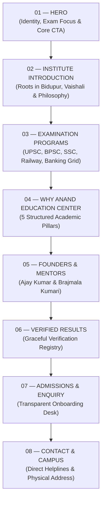
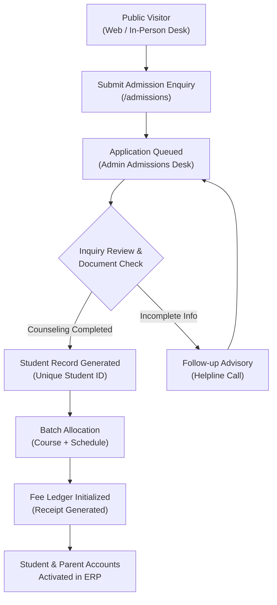
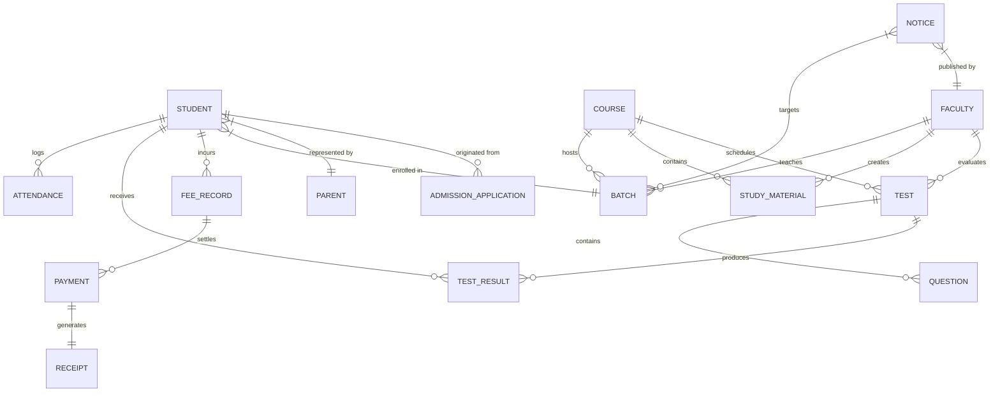

# Anand Education Center — Information Architecture & Product Structure
**Document Version:** 1.0.0  
**Status:** Approved Architectural Specification  
**Source of Truth Reference:** [`docs/BRAND_SYSTEM.md`](file:///c:/Users/User/OneDrive/Desktop/AEC/docs/BRAND_SYSTEM.md)  
**Scope:** Public Web Platform, Management ERP, Domain Relationships & Future Roadmap

---

## 1. Product Overview & Ecosystem Architecture

Anand Education Center operates as an integrated dual-product digital ecosystem designed to serve both the public-facing academic discovery process and the operational administration of the physical institute in **Bidupur, Vaishali, Bihar, India**.

```
┌────────────────────────────────────────────────────────────────────────┐
│                   ANAND EDUCATION CENTER ECOSYSTEM                     │
└───────────────────────────────────┬────────────────────────────────────┘
                                    │
         ┌──────────────────────────┴──────────────────────────┐
         ▼                                                     ▼
┌───────────────────────────────────┐ ┌───────────────────────────────────┐
│             PRODUCT A             │ │             PRODUCT B             │
│      Public Academic Website      │ │     Institute Management ERP      │
│   (Aspirants, Parents, Visitors)  │ │ (Admin, Faculty, Students, Parent)│
├───────────────────────────────────┤ ├───────────────────────────────────┤
│ • Institutional Mission & Trust   │ │ • Admissions & Batch Enrollment   │
│ • Competitive Exam Curricula      │ │ • Student Attendance & Timetables │
│ • Verified Founders & Mentors     │ │ • Fee Tracking & Receipts         │
│ • Admissions Inquiry Desk         │ │ • Test Series, Quizzes & Results  │
│ • Physical Center Contact Details │ │ • Parent Performance Visibility  │
└───────────────────────────────────┘ └───────────────────────────────────┘
```

### 1.1 Product A: Public Academic Website
- **Audience:** Civil services aspirants (UPSC, BPSC), government job aspirants (SSC, Railway, Banking), parents, local community stakeholders, and walk-in applicants.
- **Primary Objectives:** Communicate academic seriousness, establish authentic trust, present structured exam pathways, provide transparent admission inquiry pathways, and offer direct access to the Bidupur campus.
- **UX Atmosphere:** Refined editorial educational publication, calm academic gravitas, clear typography, zero fabricated claims or distraction.

### 1.2 Product B: Institute Management Platform (ERP)
- **Audience:** Super Administrators, Administrative Staff, Faculty / Subject Mentors, Enrolled Students, and Parents / Guardians.
- **Primary Objectives:** Streamline student lifecycle from initial inquiry to batch assignment, attendance monitoring, fee ledger generation, test performance analysis, and formal announcements.
- **UX Atmosphere:** High-density, data-efficient, high-contrast, task-oriented layout adhering strictly to the master brand tokens (`#0B1F3A`, `#C9A227`, `#FAFAF7`).

---

## 2. Public Website Sitemap & Navigation Architecture

The public navigation is intentionally restrained to 7 canonical sections. It does not clutter the visitor experience with internal portals or unverified marketing tabs.

### 2.1 Primary Navigation Items

| # | Navigation Label | Canonical Route | Purpose & Destination |
| :---: | :--- | :--- | :--- |
| **01** | **HOME** | `/` | Core institutional mission, exam categories, mentorship, inquiry |
| **02** | **ABOUT** | `/about` | History, institutional roots in Vaishali, educational philosophy |
| **03** | **COURSES** | `/courses` | Overview of competitive exam programs (UPSC, BPSC, SSC, Railway, Banking) |
| **04** | **FACULTY** | `/faculty` | Founders Ajay Kumar & Brajmala Kumari, mentorship structure |
| **05** | **RESULTS** | `/results` | Verified candidate achievements and formal results registry |
| **06** | **ADMISSIONS** | `/admissions` | Admission criteria, registration procedure, physical desk hours |
| **07** | **CONTACT** | `/contact` | Bidupur center address, contact numbers, direct inquiry form |

### 2.2 Header Action Elements
- **Primary Action (Global CTA):** `ENQUIRE NOW` (Directs to admissions inquiry modal or `/admissions#enquiry`).
- **Utility / Secondary Action:** `STUDENT LOGIN` (Discreet portal access link leading to `/student/login`, visually separated from editorial links).
- **Institutional Top Strip:** Displays official helpline numbers (`+91 7766959980`, `+91 9905871193`) and location badge (`Bidupur, Vaishali, Bihar`).

---

## 3. Homepage Section Hierarchy (01 to 08)

The homepage follows an editorial narrative designed to inform and build genuine academic confidence rather than push aggressive sales conversions.



### 3.1 Section 01: Hero (Academic Anchor)
- **Role:** Immediately establish who Anand Education Center is and whom it serves.
- **Core Elements:**
  - Institutional Eyebrow: `ACADEMIC EXCELLENCE & CIVIL SERVICES PREPARATION`
  - Master Heading: Serious editorial serif statement emphasizing rigorous preparation for competitive examinations.
  - Exam Program Indicators: Pill markers for `UPSC` | `BPSC` | `SSC` | `Railway` | `Banking`.
  - Dual Action Group:
    - Primary CTA: `Enquire Now`
    - Secondary CTA: `Explore Courses`
- **Integrity Rule:** No fabricated statistics (no "50,000 students", no "99.8% pass rate", no spinning counters).

### 3.2 Section 02: Institute Introduction
- **Role:** Establish geographic and institutional roots.
- **Core Content:**
  - Brief statement explaining Anand Education Center's founding in **Bidupur, Vaishali, Bihar**.
  - Commitment to providing disciplined, district-level access to high-standard preparation without forcing students to migrate unprepared to distant hubs.
  - Link / Button: `About the Institute` -> `/about`.

### 3.3 Section 03: Examination Programs Grid
- **Role:** Showcase the five core domains of competitive preparation.
- **Card Matrix:**
  1. **UPSC Civil Services Examination** (Prelims, Mains, Interview guidance)
  2. **BPSC Combined Competitive Examination** (Bihar State Civil & Administrative Services)
  3. **SSC Examination Suite** (CGL, CHSL, CPO, GD)
  4. **Railway Recruitment Board (RRB)** (NTPC, Group D, Technical, ALP)
  5. **Banking & Financial Services** (IBPS PO/Clerk, SBI PO/Clerk, RBI)
- **Each card provides:** Program title, foundational scope, key syllabus areas, and `View Program Details` link.

### 3.4 Section 04: Why Anand Education Center (Structural Pillars)
- **Role:** Highlight educational differentiators without making unsubstantiated claims.
- **The 5 Structural Academic Pillars:**
  1. *Faculty Guidance:* Direct mentorship from experienced educators.
  2. *Structured Preparation:* Syllabus sequencing, regular reviews, and clear timelines.
  3. *Practice & Testing:* Periodic objective tests, subjective answer writing, and exam-simulation drills.
  4. *Curated Study Material:* Comprehensive notes aligned with updated government exam patterns.
  5. *Personal Attention:* Manageable classroom sizes enabling one-on-one doubt clarification.
- **Integrity Rule:** Purely structural descriptions. Zero fabricated awards, years of experience, or rankings.

### 3.5 Section 05: Founders & Academic Mentorship
- **Role:** Transparent presentation of the institute's leadership.
- **Founder Profiles:**
  - **Ajay Kumar** — *Founder*
  - **Brajmala Kumari** — *Co-Founder*
- **Presentation Standard:** High-quality authentic photographs, natural framing, dignity-first editorial layout.
- **Integrity Rule:** Do not fabricate external degrees, civil service postings, or qualifications that have not been provided.

### 3.6 Section 06: Verified Results Registry
- **Role:** Present verified selections and student milestones.
- **Structure:**
  - Filter / Category: `Exam Type` | `Year`
  - Card Layout: Candidate Name, Examination Name, Selection / Rank (when verified).
- **Graceful Empty State UX:** When results are pending administrative verification, display:
  > *"Candidate milestone verification in progress. The official results registry is updated directly following document verification by the institute administration."*
- **Integrity Rule:** Zero fabricated names, ranks, or photo stock.

### 3.7 Section 07: Admissions & Direct Inquiry
- **Role:** Clear, friction-free admission advisory.
- **Core Workflow:**
  - Walk-in counseling hours at the Bidupur center.
  - Fast-inquiry form (Student Name, Contact Number, Exam Category, Query).
  - Explicit advisory note on transparent seat availability and document submission.

### 3.8 Section 08: Contact & Campus Desk
- **Role:** Complete, verified institutional coordinates.
- **Physical Address:** `Anand Education Center, Bidupur, Vaishali, Bihar, India`.
- **Verified Helplines:** `+91 7766959980` & `+91 9905871193`.
- **Operational Map & Transit Info:** Clear directions for local aspirants across Vaishali district.

---

## 4. Scalable Course Architecture

Each competitive examination program follows a standardized, modular template ensuring uniform quality and predictable UX.

### 4.1 Program Routes
- `/courses/upsc` — Union Public Service Commission Track
- `/courses/bpsc` — Bihar Public Service Commission Track
- `/courses/ssc` — Staff Selection Commission Track
- `/courses/railway` — Railway Recruitment Board (RRB) Track
- `/courses/banking` — Banking & Insurance Examinations Track

### 4.2 Standard Course Page Content Slots (11-Point Modular Template)

| Slot # | Content Slot Name | Architectural Purpose |
| :---: | :--- | :--- |
| **01** | **Course Overview** | Scope of exam, executive summary of the program, qualification levels |
| **02** | **Who This Is For** | Eligibility criteria, educational prerequisites, age benchmarks |
| **03** | **Subjects & Syllabus** | Stage-by-stage syllabus breakdown (Prelims / Mains / Tier I & II) |
| **04** | **Preparation Approach** | Pedagogy: concept foundation, question practice, current affairs integration |
| **05** | **Batch Information** | Upcoming batch timelines, morning/evening shifts (populated with real data) |
| **06** | **Faculty & Mentors** | Assigned subject mentors for the program |
| **07** | **Study Material** | Modules provided, reference book lists, handwritten summary notes |
| **08** | **Test & Practice Structure** | Weekly chapter tests, full-length mock examinations, answer writing review |
| **09** | **Class Schedule** | Weekly routine, lecture hours per subject, doubt-clearing sessions |
| **10** | **Fee Information** | Institutional fee structure, payment schedules (placeholder until confirmed) |
| **11** | **Enquiry / Admission CTA** | Immediate registration/enquiry trigger tied to this specific program |

---

## 5. Faculty & Academic Leadership Architecture

### 5.1 Directory & Profile Routes
- Directory Page: `/faculty`
- Individual Profile Pages: `/faculty/[slug]` (e.g., `/faculty/ajay-kumar`, `/faculty/brajmala-kumari`)

### 5.2 Profile Data Structure (Verified Slots Only)

```yaml
FacultyProfile:
  slug: string
  fullName: string
  designation: string          # e.g., "Founder", "Co-Founder", "Subject Mentor"
  photographUri: string        # Path to authentic photo asset
  department: string           # Exam track or subject area
  teachingFocus: string        # Academic areas emphasized
  qualifications: string[]     # ONLY verified degrees / credentials
  verifiedBio: string          # Editorial biography adhering to truth rules
  associatedCourses: Course[]  # Programs actively mentored
```

### 5.3 Initial Known Leadership
- **Ajay Kumar** — *Founder*
- **Brajmala Kumari** — *Co-Founder*
*Note: Additional faculty entries will be created only when authentic names and assignments are provided by the institute.*

---

## 6. Results Architecture & Verification Engine

### 6.1 Route & Filtering
- Dedicated Route: `/results`
- Filter Dimensions:
  - By Examination: `All` | `UPSC` | `BPSC` | `SSC` | `Railway` | `Banking`
  - By Year: Sequential chronological order (e.g., `2025`, `2024`, `2023`)

### 6.2 Data Model Structure
```yaml
VerifiedResult:
  id: string
  studentName: string
  candidatePhotoUri: string?   # Optional verified student photograph
  examination: string          # e.g., "BPSC CCE", "SSC CGL", "RRB NTPC"
  examYear: number
  rollNumber: string?          # Redacted / verified registry identifier
  achievementType: string      # "Final Selection", "Tier I Cleared", "Rank"
  rankOrPost: string           # Verified designation or rank
  verificationBadge: boolean   # Confirmed by institute administration
```

---

## 7. Admission Lifecycle & Flowchart

The admission system transitions inquiries smoothly into enrolled student records within the ERP.



### 7.1 Lifecycle Steps
1. **Public Enquiry / Application:** Candidate submits basic details (`Student Name`, `Parent Name`, `Phone`, `Address`, `Target Exam`, `Preferred Batch`).
2. **Application Received:** System generates a tracking reference number and logs the inquiry in the Admin Portal.
3. **Admin Review & Verification:** Counseling staff reviews eligibility, confirms seat capacity in Bidupur batches, and documents identity proof.
4. **Student Record Creation:** Candidate is assigned a permanent `StudentID` (e.g., `AEC-2025-0104`).
5. **Batch Assignment:** Student is linked to a specific classroom batch (e.g., `BPSC-Foundation-Morning-A`).
6. **Fee Ledger & Receipt:** Payment schedule is configured, initial installment receipt generated.
7. **Portal Account Provisioning:** Credentials generated for Student Portal (`/student`) and Parent Portal (`/parent`).

---

## 8. Student Portal Architecture (Product B)

- **Entry Route:** `/student/login`
- **Dashboard Root:** `/student`

### 8.1 Modular Feature Sections

| Section Route | Module Name | Scope & Functionality |
| :--- | :--- | :--- |
| `/student` | **Dashboard** | Overview: upcoming classes, today's schedule, latest notices, fee alert |
| `/student/profile` | **Academic Profile** | Personal details, enrolled course, batch code, student ID card view |
| `/student/attendance` | **Attendance Record** | Daily attendance calendar, percentage calculation, session-by-session log |
| `/student/schedule` | **Class Timetable** | Weekly lecture timetable, subject allocations, classroom numbers |
| `/student/materials` | **Study Material** | Downloadable PDF notes, syllabus copies, recommended reading sheets |
| `/student/assignments` | **Assignments** | Subjective answer-writing prompts, homework submission deadlines |
| `/student/tests` | **Test Series** | Upcoming mock schedules, syllabus coverage for next test |
| `/student/results` | **My Test Results** | Scorecards, rank in batch, topic-wise strengths and weaknesses |
| `/student/fees` | **Fee History** | Installment schedule, paid receipts, upcoming due dates |
| `/student/notices` | **Institute Notices** | Official announcements from Bidupur administration |
| `/student/notifications`| **Alerts & Updates** | Direct notifications regarding batch timing shifts, exam circulars |

---

## 9. Parent Portal Architecture (Product B)

Designed with extreme clarity for parents seeking honest progress updates on their ward's preparation.

- **Entry Route:** `/parent/login`
- **Dashboard Root:** `/parent`

### 9.1 Parent Portal Modules
1. **Ward Overview:** Multi-ward selector (if siblings are enrolled), overall attendance rate, current batch status.
2. **Attendance Tracker:** Visual monthly calendar showing `Present`, `Absent`, and `Holiday` logs.
3. **Test Performance Log:** Score progression across weekly and monthly test series with batch average comparisons.
4. **Official Institute Notices:** Direct notices regarding parent-mentor meetings, center holidays, and exam registration dates.
5. **Fee Ledger & Invoices:** Clear display of installments paid, downloadable official receipts, and upcoming due dates.
6. **Helpline Connect:** Direct click-to-call link to the Bidupur center desk (`7766959980` / `9905871193`).

---

## 10. Admin Portal & Management System Architecture (Product B)

- **Entry Route:** `/admin/login`
- **Dashboard Root:** `/admin`

### 10.1 Role-Based Access Control (RBAC)
- **SUPER ADMIN:** Full systemic control, user management, audit logs, financial ledger exports, system configuration.
- **ADMIN / DESK OFFICER:** Student admissions, batch allocation, fee collection, attendance logging, notice publishing.
- **FACULTY / MENTOR:** Attendance recording, test score entry, study material uploads, assignment review.

### 10.2 Admin Management Modules

```
ADMIN PORTAL (/admin)
├── Dashboard (KPIs: Active Batches, Daily Attendance, Inquiries, Pending Fees)
├── Students Management (Directory, Enrollment, ID Card Generation, Ward Mapping)
├── Admissions Desk (Lead Pipeline, Walk-In Applications, Follow-up Logs)
├── Faculty & Staff (Instructor Directory, Subject Allocations, Daily Schedule)
├── Courses & Curricula (Program Definitions, Syllabus Revisions, Subject Modules)
├── Batches & Timetables (Batch Creation, Room Assignment, Shift Timing)
├── Attendance Engine (Batch-wise Attendance Marker, Daily Defaulters List)
├── Fee & Revenue Ledger (Installment Tracker, Cash/UPI Receipt Generator, Dues)
├── Tests & Examinations (Mock Test Scheduler, Question Paper Vault, Score Entry)
├── Results & Selections (Official Results Verification, Web Showcase Toggle)
├── Study Material Library (PDF Repository, Distribution Logs)
├── Notices & Circulars (Broadcast to Student/Parent Portals, Notice Board)
├── Institutional Reports (Attendance Trends, Fee Collection, Inquiry Conversion)
└── System Settings (Institute Profile, Backup, User Roles, Helpline Numbers)
```

---

## 11. Conceptual Entity Relationships & Domain Model

The following domain relationship map establishes the conceptual data architecture linking institutional entities across Product A and Product B.



### 11.1 Key Cardinality Rules
- **Student ↔ Course & Batch:** A Student is enrolled in one primary Course Track per registration and belongs to exactly one active Batch per session.
- **Student ↔ Parent:** A Student is associated with one primary Parent/Guardian record; a Parent may represent multiple enrolled sibling students.
- **Batch ↔ Faculty:** A Batch is assigned one or more Faculty Mentors based on subject modules (General Studies, Quantitative Aptitude, Reasoning, Language, Current Affairs).
- **Fee ↔ Payment ↔ Receipt:** Each Fee Record can have multiple installment Payments; every completed Payment strictly generates a numbered Receipt.
- **Test ↔ Result:** A Test produces individual Test Results for every student enrolled in the target Batch.

---

## 12. Canonical URL Architecture

### 12.1 Public Web Platform (Product A)

```
/                             -> Homepage
/about                        -> Institutional background & philosophy
/courses                      -> Comprehensive competitive exam programs
/courses/upsc                 -> UPSC Civil Services program
/courses/bpsc                 -> BPSC Combined Competitive program
/courses/ssc                  -> SSC examinations program
/courses/railway              -> Railway Recruitment Board program
/courses/banking              -> Banking & Insurance examinations program
/faculty                      -> Academic leadership & mentorship team
/faculty/[slug]               -> Detailed mentor profile
/results                      -> Verified student results & rank registry
/admissions                   -> Admissions procedure, desk timings & enquiry
/contact                      -> Bidupur campus location & direct helplines
```

### 12.2 Authentication & Portal Boundaries (Product B)

```
/student/login                -> Student secure authentication
/student                      -> Student dashboard
/student/*                    -> Student sub-modules (profile, schedule, etc.)

/parent/login                 -> Parent secure authentication
/parent                       -> Parent dashboard
/parent/*                     -> Ward progress & attendance logs

/admin/login                  -> Secure administrative login
/admin                        -> Admin executive dashboard
/admin/*                      -> Management modules (students, fees, etc.)
```

---

## 13. Navigation & UX Separation Rules

1. **Clear Public Scoping:** The public website header must never expose internal administration links. Public visitors should only see: `Home`, `About`, `Courses`, `Faculty`, `Results`, `Admissions`, `Contact`, with `Enquire Now` as primary CTA.
2. **Discreet Authentication Gateway:** `Student Login` is housed in the utility header or rightmost corner as an access icon/label, avoiding distraction for public prospective applicants.
3. **Mobile Drawer Discipline:** The mobile drawer displays the 7 public sections with comfortable tap targets (minimum `44px`), followed by a divider, the helpline phone links (`7766959980` / `9905871193`), and a distinct button for `Student Portal`.
4. **Portal Session Isolation:** Once inside `/student`, `/parent`, or `/admin`, the public website header is replaced by a dedicated portal workspace layout (sidebar navigation, user status, logout).

---

## 14. Public Website vs. ERP Boundary

| Architectural Dimension | Product A: Public Website | Product B: Management ERP |
| :--- | :--- | :--- |
| **Primary Goal** | Trust-building, academic discovery, enquiry | Daily operations, student record tracking, billing |
| **Authentication** | None (Fully public, static/cached delivery) | Role-Based Access Control (JWT / Session Cookie) |
| **Data Mutability** | Read-heavy (Infrequent administrative updates) | Write-heavy (Continuous daily operational updates) |
| **Layout Mode** | Spacious editorial typography, 1200px max-width | Dense data grids, data tables, sidebar workspace |
| **Shared Assets** | Master Logo, Navy/Gold tokens, typography scales, institutional branding | Master Logo, Navy/Gold tokens, typography scales, institutional branding |

---

## 15. Future Expansion Roadmap

The architecture is structured to accommodate the following future modules without architectural rework:

1. **Online Test Series Engine:** Interactive timed examination interface for prelims simulations (objective MCQ engine with negative marking).
2. **Current Affairs Digest:** Monthly bilingual PDF magazine and daily news analysis tailored to UPSC and BPSC syllabi.
3. **Automated WhatsApp Attendance Alerts:** Automated SMS/WhatsApp notification to parents when a student is marked absent at the Bidupur center.
4. **Digital Fee Payment Gateway:** Integration with UPI/QR code and official banking channels for online receipt generation.
5. **Direct Study Material Distribution:** Authenticated PDF watermarking system preventing unauthorized distribution of proprietary AEC notes.
6. **Student Performance Analytics:** AI/Statistical topic-wise diagnostic breakdowns for students preparing for competitive cutoffs.

---

*This document serves as the complete architectural foundation for Anand Education Center. Subsequent development steps will strictly implement the specifications defined herein.*
